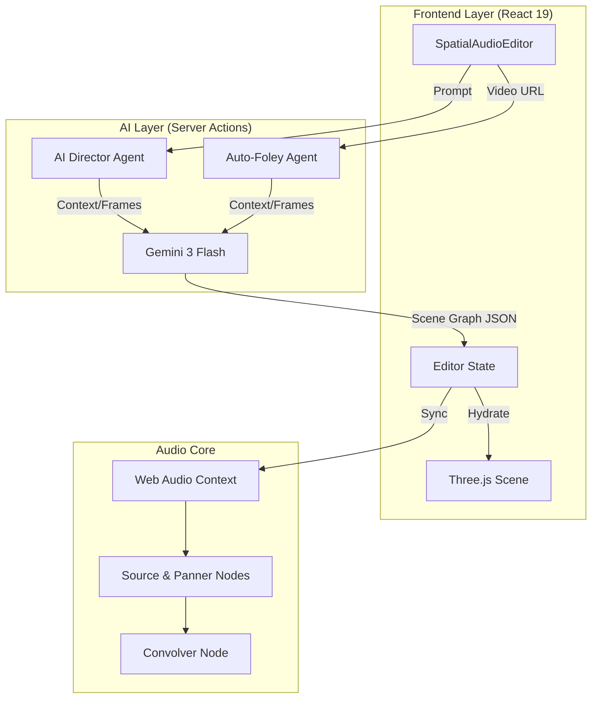

# Hackathon Submission: Resonance

## 💡 Inspiration
The spark for **Resonance** came from a personal frustration. I tried building a VR game, but the spatial audio tools were prohibitively complex and expensive. I often create content for Instagram using free text-to-video generators, but the results always felt "soulless"—visually impressive but sonically flat. Syncing stock SFX manually was a tedious, hours-long process that drained the creativity out of the workflow.

I realized that **Google's Gemini 3** possesses an exceptional ability to understand not just *what* is in a video, but *where* it is. It can recognize spatial and temporal information—depth, movement, and material physics—better than any previous model.

I thought: *What if I could just drag a video in, and have an AI "watch" it and populate the 3D soundscape for me?*

Resonance was born to bridge this gap. It creates immersive, high-quality soundscapes by extracting the "hidden layer" of spatial information from video, reducing hours of manual sync work to seconds of AI processing.

## 🚀 What it does
**Resonance** is the world's first **Browser-Based DAW with AI Integration for Multimodal Understanding**. It transforms natural language and video into immersive 3D audio environments.

1.  **Auto-Foley (Video-to-Spatial):** Users upload a video, and our "Auto-Foley Agent" (Gemini 3) analyzes the visual frames. It identifies events (footsteps, breaking glass, engines), determines their material properties, and—crucially—estimates their **3D coordinates and trajectory** relative to the camera POV. It then retrieves or generates the corresponding SFX and places them in the 3D scene, perfectly synchronized.
2.  **Text-to-Scene (AI Director):** The AI Director abstracts away the complexity of spatial audio. If a user has a scene but wants to add specific elements, they can simply type *"add a bird around my head"*. Gemini 3 recognizes what "around my head" means spatially, selects the appropriate bird sound, and generates the orbital trajectory automatically—no manual engineering required.
3.  **Visual DAW:** It visualizes sound as 3D objects in a browser-based canvas. Users can grab, move, and animate sound sources intuitively.
4.  **Spatial Export:** The engine renders a high-fidelity spatial mix or a multi-channel WAV, ready for VR/AR development or immersive video.

## ⚙️ How we built it

### Technology Stack
*   **Frontend:** **Next.js 16 (App Router)**, **React 19**, **Tailwind CSS 4**.
*   **3D / Visuals:** **Three.js**.
*   **AI:** **Google Gemini 3 Flash Preview** via Google AI Studio API Keys.
*   **Audio Engine:** Native **Web Audio API** (Oscillators, GainNodes, Panners, Convolvers).
*   **Backend & Storage:** **Supabase** (PostgreSQL, Auth, Storage).
*   **Dev Tools:** **Antigravity** (Spec-Driven Development with Gemini Agents).

### Architecture
Resonance bridges a reactive UI, a robust 3D scene graph, and a low-latency audio engine.

### Implementation Highlights
*   **Hybrid Upload Strategy:** To overcome the 4.5MB Serverless limit, we engineered a "Direct-to-Storage, Stream-to-AI" pipeline.
*   **The "Zombie" Canvas Fix:** We implemented a rigid state-machine lock (`isSceneReady`) to prevent race conditions between Repaints and Audio Graph initializations.
*   **Gemini as a Physics Engine:** We don't just ask Gemini for text; we ask it for *vectors*. By few-shot prompting the model with our grid's coordinate system, we turned an LLM into a spatial reasoning engine.
*   **Persistence Layer:** **Supabase** stores project metadata (JSON scene graphs) and large media files (Video/Audio), while **IndexedDB** caches heavy audio buffers locally, ensuring instant playback on project reload.

## 🧗 Challenges we ran into
1.  **The "4.5MB Wall":** Our biggest hurdle was handling high-quality user videos. Vercel's serverless functions reject large payloads. We engineered a solution where the client uploads directly to a secure Supabase bucket, and the server agent "polls" this bucket to hand off the URL to Gemini, bypassing the limitation entirely.
2.  **The "Zombie" Canvas:** We faced a critical race condition where navigating between projects caused the 3D logic to initialize before the data was ready, leading to "ghost" sources that existed in memory but not on screen. We fixed this by implementing a rigid state-machine lock (`isSceneReady`) that gates data injection until the Three.js graph is fully hydrated.
3.  **Prompt Engineering Coordinates:** Getting an LLM to "hear" in 3D is hard. We had to teach the AI not just *what* to place, but *where*. This "Spatial System Prompt" was critical for the AI to understand the user's head position and ears as the origin (0,0,0) and map video depth to our coordinate system, ensuring sounds like "footsteps behind you" were actually placed at `-Z`.

## 🏅 Accomplishments that we're proud of
*   **It actually "sees" depth:** Watching the Auto-Foley agent accurately place a "footstep" sound *further away* when a character walks into the distance, and attach a trajectory to it based on the video frame's POV, was a "magic moment."
*   **Real-time Logic:** The system feels alive. You type, and seconds later, a scene appears.
*   **First Browser-Based DAW with AI Integration:** We built a tool that brings native desktop-grade spatial audio authoring to the web foundary, powered by multimodal AI understanding.
*   **Environmental Acoustics (Reverb):** We didn't just want "dry" sounds. We implemented a convolution reverb engine using Impulse Responses (IR). When the AI detects a "Cave" or "Hall", it doesn't just change a metadata tag—it swaps the Web Audio `convolverNode` buffer to physically model the acoustic reflections of that space, grounding the generated sounds in reality.

## 📚 What we learned
*   **Multimodal is Spatial:** LLMs aren't just for text/images. Gemini demonstrated a surprising grasp of 3D space when simply asked to "estimate depth" from a 2D video.
*   **Audio on the Web is Ready:** The Web Audio API combined with React 19 is powerful enough for pro-grade tools, provided you manage the "Imperative vs Declarative" sync carefully.
*   **Vibe Coding vs. Spec-Driven Development:** We learned that "Vibe Coding" is excellent for sprinting to validate ideas quickly, but adopting **Spec-Driven Development** is the way forward for true AI-native engineering. It is the difference between running a sprint and a marathon—essential for long-term robustness.

## 🔮 What's next for Resonance - The **IAMF** Revolution
*   **Third-Party Sound Libraries:** Currently, we rely on a limited open-source sound set. We plan to integrate with massive third-party APIs (like Freesound or Epidemic Sound) to provide users with an infinite palette of high-quality audio assets to tweak and spatialise.
*   **World-First IAMF Export:** Resonance is building the world's first browser-based pipeline for **IAMF (Immersive Audio Model and Formats)**, the revolutionary open standard co-developed by **Google** and AOMedia. IAMF is the backbone of next-gen spatial audio on **YouTube** and **Android**. Resonance democratizes this powerful format, allowing *any* creator to generate studio-grade, Google-compatible spatial audio mixes directly from their browser, unlocking the full potential of the immersive web for everyone and for all devices including sound bars, car speakers, and mobile.
*   **XR Engine Bridge:** One-click export of scene graphs to **Unity** and **Unreal Engine**, allowing game developers to "prompt" a level's audio and drop it directly into their game world.
*   **Collaborative Logic:** Multiplayer sessions where a Director (AI) and a Sound Designer (Human) can co-create deeply interactive audio logic in real-time.

## 🛠 Built With
nextjs
react
threejs
web-audio-api
google-gemini
supabase
typescript
tailwind
antigravity
