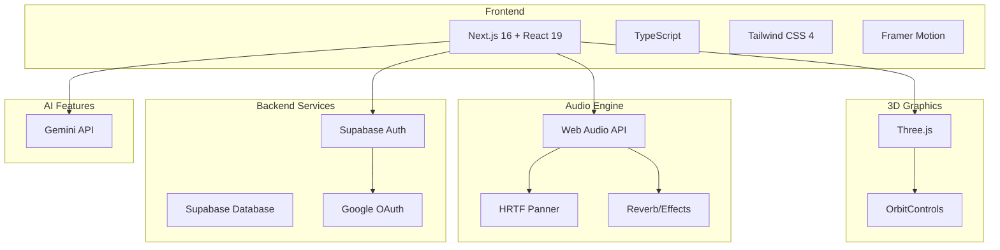
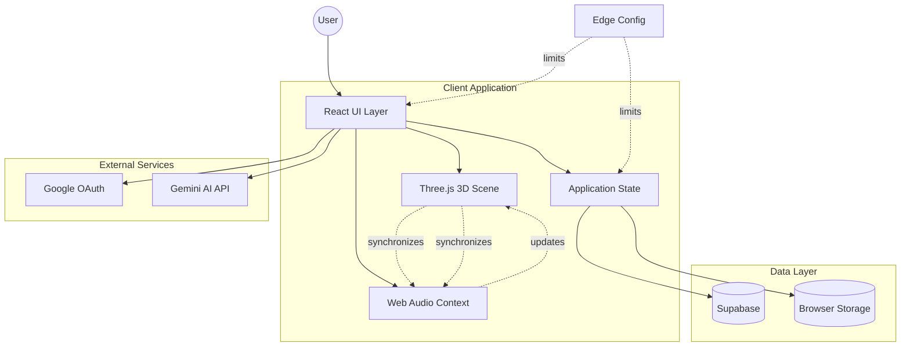
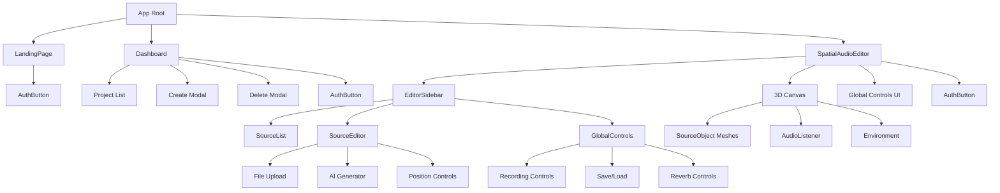
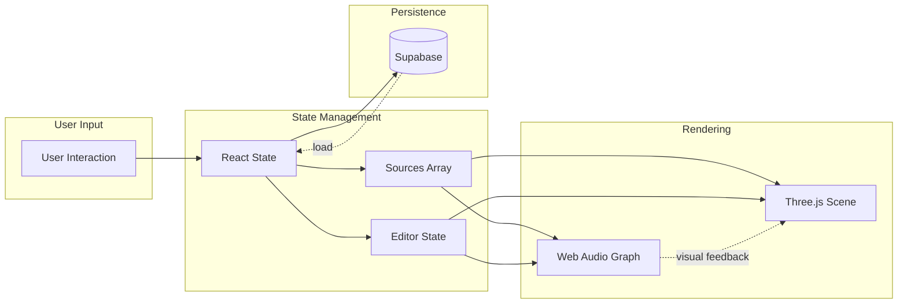
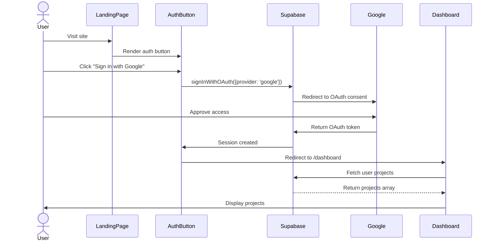
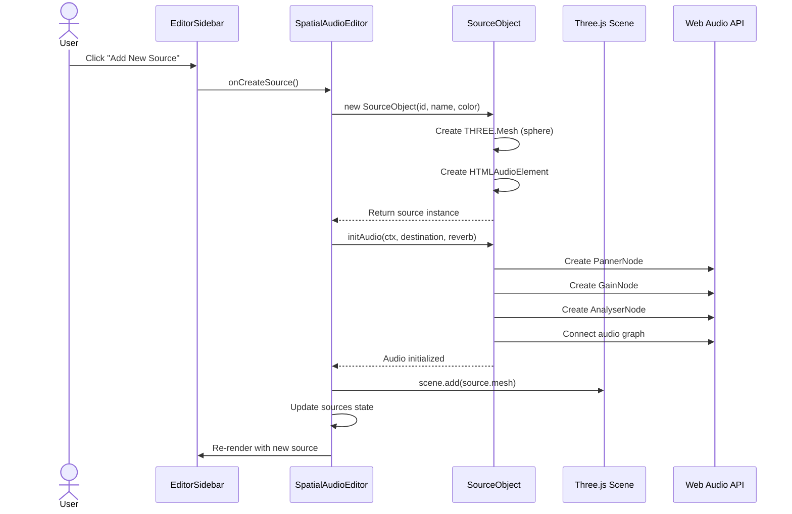
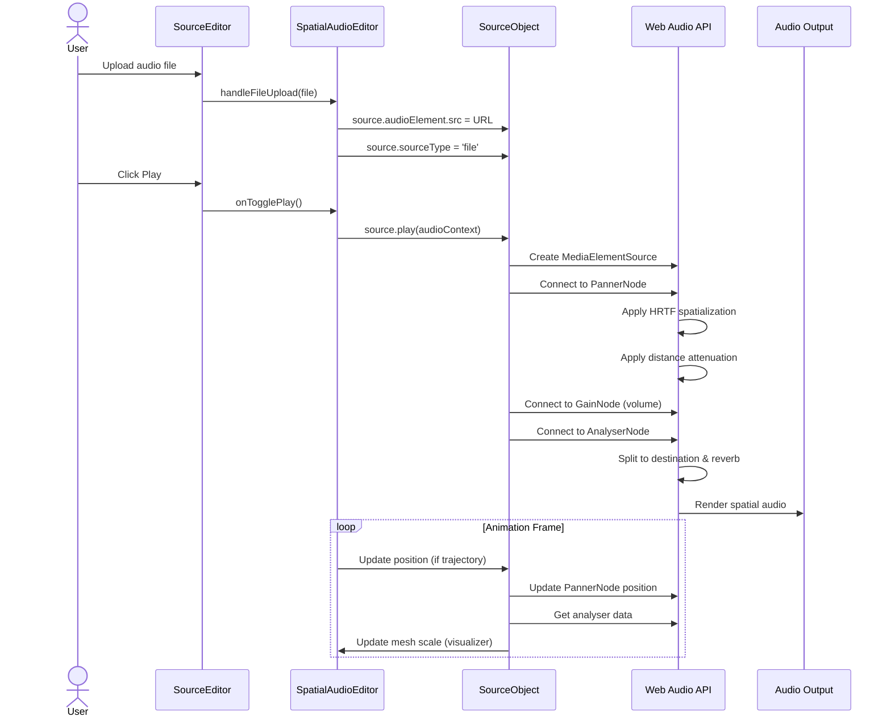
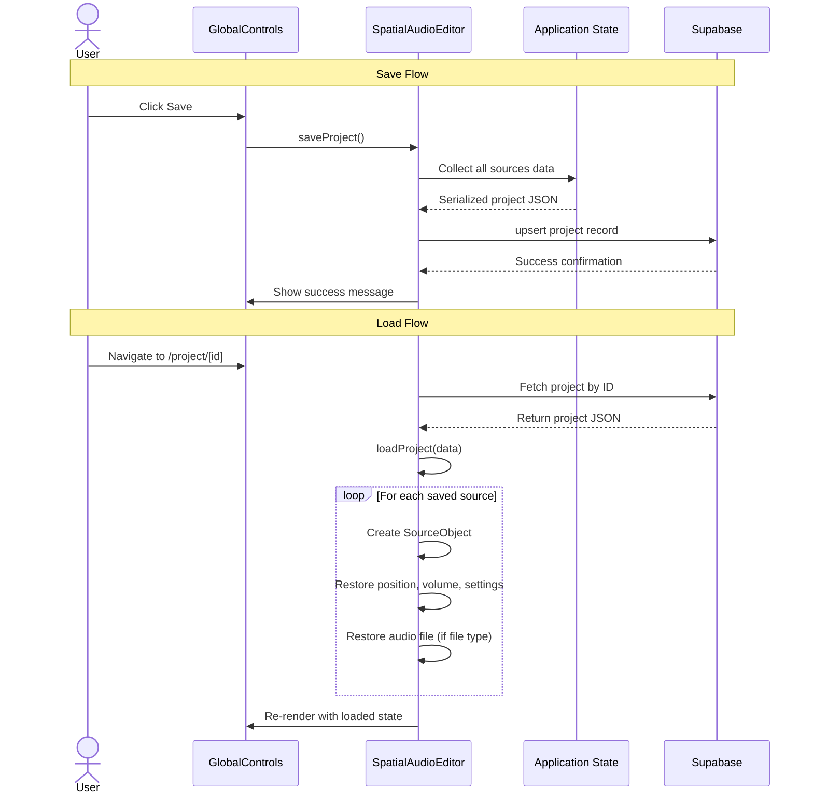
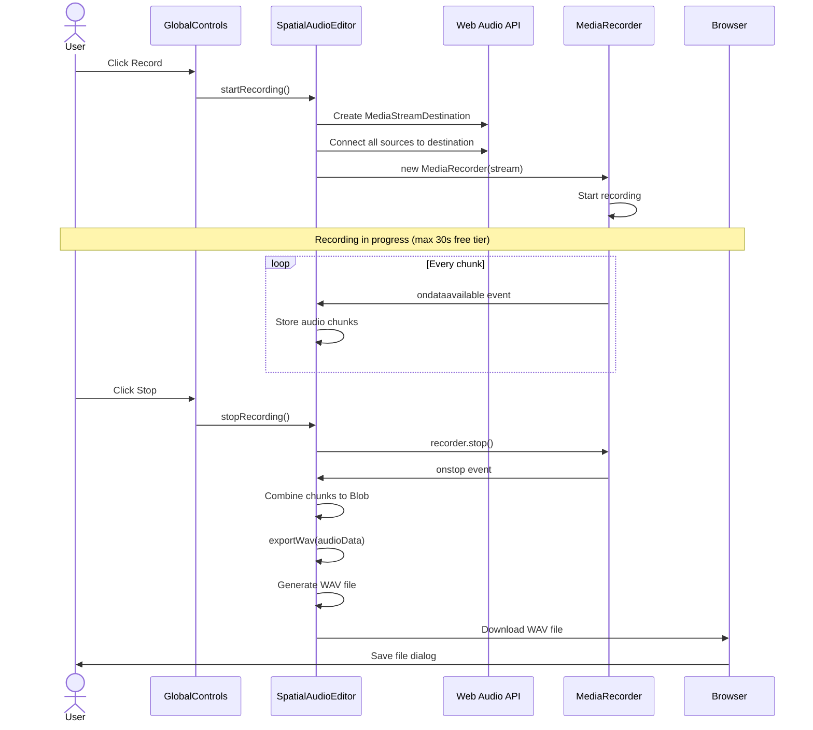

# Spaudio - Spatial Audio Editor

> **Reimagine sound in 3D space.** A next-generation web-based spatial audio editor that lets you create, position, and animate audio sources in an interactive 3D environment with HRTF (Head-Related Transfer Function) spatial audio rendering.

  

---

## 📋 Table of Contents

- [Overview](#-overview)
- [Key Features](#-key-features)
- [Architecture](#-architecture)
- [System Flows](#-system-flows)
- [Component Documentation](#-component-documentation)
- [Low-Level Technical Details](#-low-level-technical-details)
- [Getting Started](#-getting-started)
- [API Reference](#-api-reference)
- [Contributing](#-contributing)

---

## 🎯 Overview

**Spaudio** is a web-based spatial audio editor that combines 3D visualization with spatial audio processing. Built for sound designers, game developers, and audio engineers, it enables real-time manipulation of audio sources in 3D space with professional-grade spatial audio rendering.

### Use Cases

- 🎮 **Game Audio Design**: Position and test game audio assets in 3D space
- 🎬 **Film Post-Production**: Create immersive soundscapes for VR/AR content
- 🎵 **Music Production**: Experiment with spatial audio mixing
- 🔬 **Audio Research**: Test and prototype spatial audio algorithms
- 🎓 **Education**: Teach spatial audio concepts with interactive visualization

### Technology Stack



---

## ✨ Key Features

### 🎵 Audio Management
- **Multi-Source Support**: Create and manage multiple independent audio sources
- **File Upload**: Support for common audio formats (MP3, WAV, OGG)
- **AI Generation**: Generate audio from text prompts using Gemini AI (Pro feature)
- **Volume Control**: Independent gain control for each source

### 🌍 3D Spatial Audio
- **HRTF Positioning**: Realistic head-related transfer function for binaural audio
- **Distance Attenuation**: Configurable distance models (inverse, linear, exponential)
- **Reverb Effects**: Global reverb with adjustable wet/dry mix
- **Real-time Rendering**: Low-latency spatial audio processing

### 🎬 Animation & Trajectory
- **Motion Paths**: Animate sources along custom trajectories
- **AI Director**: Generate movement patterns from natural language prompts
- **Keyframe Support**: Manual trajectory editing (planned)

### 💾 Project Management
- **Save/Load**: Persist projects to Supabase database
- **Multi-Project Dashboard**: Manage multiple spatial audio projects
### 💾 Project Management
- **Save/Load**: Persist projects to Supabase database
- **Multi-Project Dashboard**: Manage multiple spatial audio projects
- **Missing File Detection**: Visual alerts for sources with deleted audio files
- **Edge Config Integration**: Dynamic tier limits and pricing via Vercel Edge Config

### 🎙️ Recording & Export
- **Spatial Rendering**: Record spatial mix to stereo WAV file
- **Time-Limited Recording**: Free tier supports 30-second recordings
- **Professional Export**: Uncompressed WAV output

---

## 🏗️ Architecture

### High-Level System Architecture



### Component Hierarchy



### Data Flow Architecture



---

## 🔄 System Flows

### Authentication Flow



### Audio Source Creation Flow



### Playback & Spatial Audio Processing Flow



### Project Save/Load Flow



### Recording & Export Flow



---

## 📦 Component Documentation

### Core Components

#### `SpatialAudioEditor`
**Location**: [`src/components/SpatialAudioEditor.tsx`](file:///Users/ambrose_/Desktop/exploration/Spaudio/spaudio-app/src/components/SpatialAudioEditor.tsx)

The main editor component that orchestrates the entire spatial audio editing experience.

**Responsibilities**:
- Three.js scene initialization and management
- Web Audio API context and graph setup
- Source creation, selection, and manipulation
- File upload handling
- AI audio generation
- Project save/load
- Recording and export
- Trajectory animation

**Key State**:
```typescript
- sources: SourceObject[]          // All audio sources in the scene
- selectedId: string | null        // Currently selected source
- editorState: EditorState         // Active source editor state
- isRecording: boolean             // Recording status
- isPro: boolean                   // User subscription tier
```

**Props**:
```typescript
interface SpatialAudioEditorProps {
  projectId?: string;  // Optional project ID for loading saved projects
}
```

---

#### `Dashboard`
**Location**: [`src/components/Dashboard.tsx`](file:///Users/ambrose_/Desktop/exploration/Spaudio/spaudio-app/src/components/Dashboard.tsx)

Project management dashboard for authenticated users.

**Responsibilities**:
- Display user's projects in a grid layout
- Create new projects
- Edit project names
- Delete projects
- Navigate to project editor
- User logout

**Props**:
```typescript
interface DashboardProps {
  projects: Project[];  // Array of user's projects
  user: User;          // Authenticated Supabase user
}
```

---

#### `EditorSidebar`
**Location**: [`src/components/spaudio/EditorSidebar.tsx`](file:///Users/ambrose_/Desktop/exploration/Spaudio/spaudio-app/src/components/spaudio/EditorSidebar.tsx)

Main control panel with three tabs: Sources, Properties, and Global.

**Responsibilities**:
- Tab navigation (Sources, Properties, Global)
- Source list display
- Active source property editing
- Global controls access
- UI state management

**Tabs**:
- **Sources**: List of audio sources, add new source button
- **Properties**: Edit active source (position, volume, audio, trajectory)
- **Global**: Recording, save/load, reverb settings

---

### Audio Components

#### `SourceList`
**Location**: [`src/components/spaudio/SourceList.tsx`](file:///Users/ambrose_/Desktop/exploration/Spaudio/spaudio-app/src/components/spaudio/SourceList.tsx)

Displays all audio sources with selection and deletion controls.

**Features**:
- Visual list of sources with color indicators
- Play/pause status icons
- Source selection (highlights active source)
- Delete source button
- Empty state message

---

#### `SourceEditor`
**Location**: [`src/components/spaudio/SourceEditor.tsx`](file:///Users/ambrose_/Desktop/exploration/Spaudio/spaudio-app/src/components/spaudio/SourceEditor.tsx)

Property editor for the currently selected audio source.

**Controls**:
- **Name**: Editable source name
- **Position**: X, Y, Z sliders (-10 to +10)
- **Volume**: Gain slider (0 to 2)
- **Audio Source**: File upload or AI generation
- **Playback**: Play/pause toggle
- **Trajectory**: AI-generated motion paths

---

#### `GlobalControls`
**Location**: [`src/components/spaudio/GlobalControls.tsx`](file:///Users/ambrose_/Desktop/exploration/Spaudio/spaudio-app/src/components/spaudio/GlobalControls.tsx)

Global editor settings and actions.

**Features**:
- **Recording**: Start/stop spatial audio recording
- **Save/Load**: Project persistence
- **Reverb**: Global reverb wet/dry control
- **Pro Status**: Display free tier limitations

---

## 🔬 Low-Level Technical Details

### Audio Engine Architecture

#### SourceObject Class
**Location**: [`src/lib/audio/SourceObject.ts`](file:///Users/ambrose_/Desktop/exploration/Spaudio/spaudio-app/src/lib/audio/SourceObject.ts)

Core audio source implementation that bridges Three.js visualization with Web Audio API.

**Audio Graph per Source**:
```
MediaElementSource / BufferSource
        ↓
    PannerNode (HRTF spatialization)
        ↓
    GainNode (volume control)
        ↓
    AnalyserNode (visualization data)
        ↓
    [Destination + ReverbSend]
```

**Key Methods**:

```typescript
class SourceObject {
  // Initialize Web Audio nodes and graph
  initAudio(ctx: AudioContext, destination: AudioNode, reverbSend: AudioNode): void
  
  // Update 3D position (both mesh and panner)
  updatePosition(x: number, y: number, z: number): void
  
  // Start playback (file or generated audio)
  play(ctx: AudioContext): void
  
  // Stop playback
  stop(): void
}
```

**Spatial Audio Configuration**:
- **Panning Model**: HRTF (Head-Related Transfer Function) for realistic binaural audio
- **Distance Model**: Inverse (volume decreases with distance)
- **Reference Distance**: 2 units (full volume within this range)
- **Max Distance**: 50 units (minimum attenuation after this distance)

---

### 3D Rendering Pipeline

#### Scene Setup
```typescript
// Renderer configuration
const renderer = new THREE.WebGLRenderer({ 
  antialias: true, 
  alpha: true 
});
renderer.setPixelRatio(window.devicePixelRatio);
renderer.shadowMap.enabled = true;
renderer.toneMapping = THREE.ACESFilmicToneMapping;
renderer.toneMappingExposure = 1.2;

// Camera setup
const camera = new THREE.PerspectiveCamera(
  50,                          // FOV
  width / height,              // Aspect ratio
  0.1,                         // Near plane
  1000                         // Far plane
);

// Lighting
- DirectionalLight: Main scene illumination with shadows
- AmbientLight: Soft fill lighting
- HemisphereLight: Sky/ground gradient lighting
```

#### Audio Source Visualization
Each source is rendered as:
- **Sphere Geometry**: 0.5 unit radius, 32x32 subdivisions
- **Material**: MeshStandardMaterial with emissive properties
- **Animation**: Scale pulses based on audio amplitude (analyser data)
- **Color**: Unique color per source for visual identification

#### Raycasting & Selection
```typescript
// Mouse interaction
const raycaster = new THREE.Raycaster();
raycaster.setFromCamera(mousePos, camera);
const intersects = raycaster.intersectObjects(
  sources.map(s => s.mesh)
);
// Select intersected source
```

---

### Spatial Audio Algorithm

#### HRTF Processing
The Web Audio API's `PannerNode` with HRTF model simulates how sound reaches human ears:

1. **Interaural Time Difference (ITD)**: Delay between left/right ears based on source angle
2. **Interaural Level Difference (ILD)**: Volume difference between ears
3. **Spectral Cues**: Frequency filtering based on ear/head shape

#### Distance Attenuation
Using the inverse distance model:

```
gain = refDistance / (refDistance + rolloffFactor × (distance - refDistance))
```

- **refDistance**: 2 (distance where no attenuation occurs)
- **rolloffFactor**: 1 (standard rolloff rate)
- **distance**: Euclidean distance from listener to source

#### Reverb Implementation
```typescript
// Global convolution reverb
const convolver = audioContext.createConvolver();
const reverbGain = audioContext.createGain();

// Each source splits to:
// 1. Direct path → destination (dry signal)
// 2. Reverb send → convolver → destination (wet signal)

source.panner.connect(destination);      // Dry
source.panner.connect(reverbGain);        // Wet
reverbGain.connect(convolver);
convolver.connect(destination);
```

---

### File Format Support

#### Supported Audio Formats
- **MP3**: MPEG Layer 3 audio
- **WAV**: Waveform Audio File Format
- **OGG**: Ogg Vorbis
- **M4A**: MPEG-4 Audio
- **WEBM**: WebM audio
- **FLAC**: Free Lossless Audio Codec (browser support varies)

#### Export Format
- **Format**: WAV (Waveform Audio)
- **Sample Rate**: 44100 Hz (CD quality)
- **Bit Depth**: 32-bit float (converted to 16-bit PCM on export)
- **Channels**: 2 (stereo)
- **Encoding**: Uncompressed PCM

---

### Database Schema

#### Projects Table
```sql
CREATE TABLE projects (
  id UUID PRIMARY KEY DEFAULT uuid_generate_v4(),
  user_id UUID REFERENCES auth.users(id) ON DELETE CASCADE,
  name TEXT NOT NULL,
  data JSONB NOT NULL,          -- Serialized project state
  created_at TIMESTAMPTZ DEFAULT NOW(),
  updated_at TIMESTAMPTZ DEFAULT NOW()
);

-- Index for user queries
CREATE INDEX idx_projects_user_id ON projects(user_id);
```

#### Project Data Structure (JSONB)
```typescript
interface ProjectData {
  sources: Array<{
    id: string;
    name: string;
    color: string;              // Hex color
    position: { x: number; y: number; z: number };
    volume: number;
    sourceType: 'none' | 'file' | 'generated';
    audioUrl?: string;          // For file sources
    audioData?: string;         // For generated sources (base64)
  }>;
  settings: {
    reverbAmount: number;
  };
}
```

---

## 🚀 Getting Started

### Prerequisites

- **Node.js**: v18.0.0 or higher
- **npm**: v8.0.0 or higher (or pnpm/yarn/bun)
- **Supabase Account**: For authentication and database
- **Google Cloud Project**: For OAuth credentials
- **Gemini API Key**: (Optional) For AI features

### Environment Setup

1. **Clone the repository**:
   ```bash
   git clone <repository-url>
   cd spaudio-app
   ```

2. **Install dependencies**:
   ```bash
   npm install
   # or
   yarn install
   # or
   pnpm install
   ```

3. **Configure environment variables**:

   Create a `.env.local` file in the root directory:

   ```env
   # Supabase Configuration (Required)
   NEXT_PUBLIC_SUPABASE_URL=https://your-project.supabase.co
   NEXT_PUBLIC_SUPABASE_ANON_KEY=your-anon-key
   
   # Gemini AI Configuration (Optional - for AI features)
   NEXT_PUBLIC_GEMINI_API_KEY=your-gemini-api-key
   
   # Free Tier Limits (Optional - defaults shown, overridden by Edge Config)
   NEXT_PUBLIC_MAX_FREE_SOURCES=3
   NEXT_PUBLIC_MAX_FREE_REC_TIME=30000

   # Vercel Edge Config (Required for dynamic limits)
   EDGE_CONFIG=https://edge-config.vercel.com/...
   ```

4. **Set up Supabase**:

   a. Create a new Supabase project at [supabase.com](https://supabase.com)
   
   b. Enable Google OAuth:
      - Navigate to Authentication → Providers
      - Enable Google provider
      - Add your Google OAuth credentials
   
   c. Create the projects table:
   ```sql
   CREATE TABLE projects (
     id UUID PRIMARY KEY DEFAULT uuid_generate_v4(),
     user_id UUID REFERENCES auth.users(id) ON DELETE CASCADE,
     name TEXT NOT NULL,
     data JSONB NOT NULL,
     created_at TIMESTAMPTZ DEFAULT NOW(),
     updated_at TIMESTAMPTZ DEFAULT NOW()
   );
   
   CREATE INDEX idx_projects_user_id ON projects(user_id);
   ```
   
   d. Set up Row Level Security (RLS):
   ```sql
   ALTER TABLE projects ENABLE ROW LEVEL SECURITY;
   
   -- Users can only see their own projects
   CREATE POLICY "Users can view own projects"
     ON projects FOR SELECT
     USING (auth.uid() = user_id);
   
   -- Users can insert their own projects
   CREATE POLICY "Users can insert own projects"
     ON projects FOR INSERT
     WITH CHECK (auth.uid() = user_id);
   
   -- Users can update their own projects
   CREATE POLICY "Users can update own projects"
     ON projects FOR UPDATE
     USING (auth.uid() = user_id);
   
   -- Users can delete their own projects
   CREATE POLICY "Users can delete own projects"
     ON projects FOR DELETE
     USING (auth.uid() = user_id);
   ```

5. **Configure Google OAuth**:

   a. Go to [Google Cloud Console](https://console.cloud.google.com)
   
   b. Create a new project or select existing
   
   c. Enable Google+ API
   
   d. Create OAuth 2.0 credentials:
      - Authorized redirect URIs: `https://your-project.supabase.co/auth/v1/callback`
   
   e. Add credentials to Supabase (Authentication → Providers → Google)

### Development

Start the development server:

```bash
npm run dev
```

Open [http://localhost:3000](http://localhost:3000) to view the application.

The application will hot-reload as you edit files.

### Build for Production

```bash
npm run build
npm run start
```

### Linting

```bash
npm run lint
```

---

## 📚 API Reference

### TypeScript Interfaces

#### SourceData
```typescript
interface SourceData {
  id: string;                    // Unique source identifier
  name: string;                  // Display name
  color: string;                 // Hex color for visualization
  position: {                    // 3D position
    x: number;
    y: number;
    z: number;
  };
  volume: number;                // Gain (0-2)
  sourceType: SourceType;        // Audio source type
  isPlaying: boolean;            // Playback state
  hasTrajectory: boolean;        // Has motion path
}
```

#### EditorState
```typescript
interface EditorState {
  name: string;                  // Source name
  x: number;                     // X position
  y: number;                     // Y position
  z: number;                     // Z position
  vol: number;                   // Volume (0-2)
  sourceType: SourceType;        // 'none' | 'file' | 'generated'
  isPlaying: boolean;            // Playback status
}
```

#### SourceType
```typescript
type SourceType = 'none' | 'file' | 'generated';
```

---

### SourceObject API

#### Constructor
```typescript
constructor(id: string, name: string, color: THREE.Color)
```

#### Methods

**`initAudio(ctx: AudioContext, destination: AudioNode, reverbSend: AudioNode): void`**
- Initializes the Web Audio API graph for this source
- Creates PannerNode, GainNode, and AnalyserNode
- Connects nodes in the audio processing chain

**`updatePosition(x: number, y: number, z: number): void`**
- Updates both the 3D mesh position and audio panner position
- Synchronizes visual and audio representations

**`play(ctx: AudioContext): void`**
- Starts audio playback
- Handles both file-based and buffer-based sources
- Resumes AudioContext if suspended

**`stop(): void`**
- Stops audio playback
- Pauses HTMLAudioElement or stops BufferSourceNode

#### Properties

```typescript
class SourceObject {
  id: string;
  name: string;
  color: THREE.Color;
  isPlaying: boolean;
  position: { x: number; y: number; z: number };
  volume: number;
  sourceType: SourceType;
  mesh: THREE.Mesh;              // 3D visual representation
  audioElement: HTMLAudioElement;
  panner: PannerNode | null;
  gain: GainNode | null;
  analyser: AnalyserNode | null;
  buffer: AudioBuffer | null;    // For generated audio
}
```

---

## 🤝 Contributing

We welcome contributions! Here's how to get started:

### Development Workflow

1. **Fork the repository**
2. **Create a feature branch**: `git checkout -b feature/your-feature-name`
3. **Make your changes**
4. **Test thoroughly**: Ensure audio playback, spatial positioning, and UI work correctly
5. **Commit with clear messages**: `git commit -m "Add feature: description"`
6. **Push to your fork**: `git push origin feature/your-feature-name`
7. **Open a Pull Request**

### Code Style

- **TypeScript**: Use strict typing, avoid `any` when possible
- **React**: Functional components with hooks
- **Formatting**: Consistent with existing code style
- **Comments**: Add JSDoc comments for complex functions
- **Naming**: Descriptive variable and function names

### Testing Checklist

Before submitting a PR, verify:
- [ ] Audio sources create and play without errors
- [ ] Spatial positioning works correctly (left/right/distance)
- [ ] 3D visualization syncs with audio
- [ ] Save/load functionality preserves all state
- [ ] Recording exports valid WAV files
- [ ] UI is responsive and accessible
- [ ] No console errors or warnings
- [ ] Works in Chrome, Firefox, and Safari

### Areas for Contribution

- 🎨 **UI/UX Improvements**: Enhance the editor interface
- 🔊 **Audio Features**: Add new spatial audio effects
- 🎬 **Animation**: Improve trajectory system with keyframes
- 🧪 **Testing**: Add unit and integration tests
- 📱 **Mobile Support**: Optimize for touch devices
- 🌍 **i18n**: Add internationalization support
- 📖 **Documentation**: Improve guides and tutorials
- 🐛 **Bug Fixes**: Fix reported issues

---

## 📄 License

MIT License - See LICENSE file for details

---

## 🙏 Acknowledgments

- **Three.js**: 3D graphics library
- **Web Audio API**: Browser audio processing
- **Supabase**: Backend infrastructure
- **Next.js**: React framework
- **Vercel**: Deployment platform

---

## 📞 Support

- **Issues**: [GitHub Issues](https://github.com/your-repo/issues)
- **Discussions**: [GitHub Discussions](https://github.com/your-repo/discussions)
- **Email**: support@spaudio.com

---

**Built with ❤️ for the spatial audio community**
